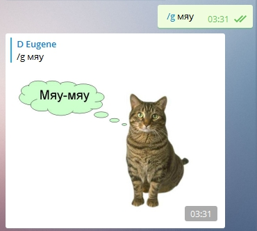
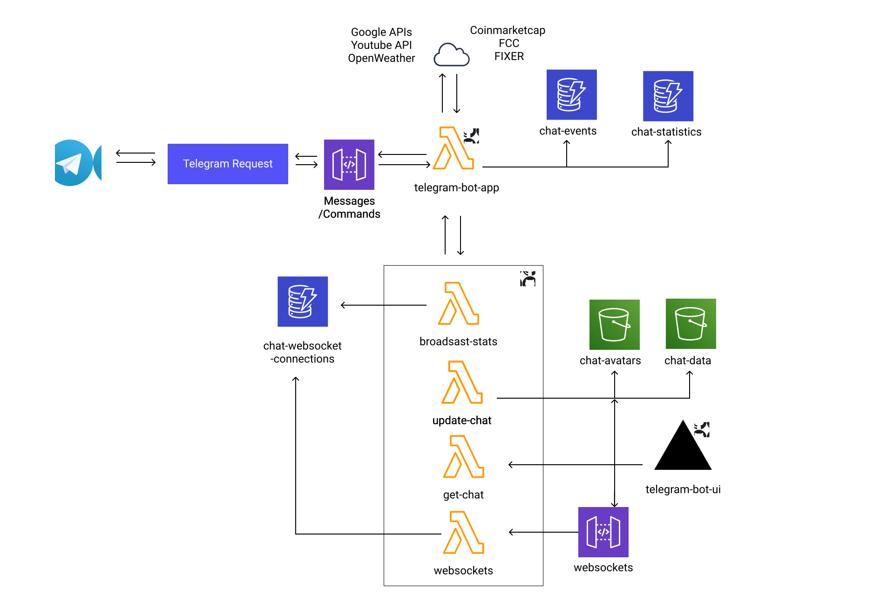

# AWS serverless telegram bot 

Serverless telegram bot based on [telegraf](https://github.com/telegraf/telegraf) and [serverless framework](https://github.com/serverless/serverless)

## Bot Architecture

#### Repositories from scheme:

[telegram-bot-ui](https://github.com/EugeneDraitsev/telegram-bot-ui)

[telegram-bot-websockets](https://github.com/EugeneDraitsev/telegram-bot-websockets)

