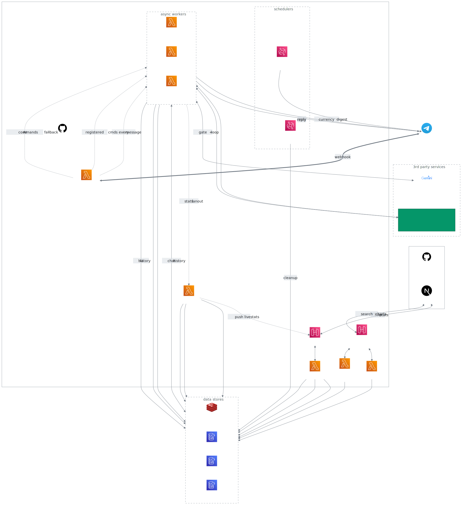

# AWS serverless telegram bot

Serverless Telegram bot based on [grammY](https://github.com/grammyjs/grammY)
and [Serverless Framework](https://github.com/serverless/serverless).

## Architecture

<a href=".github/architecture-light.svg">
  <picture>
    <source media="(prefers-color-scheme: dark)" srcset=".github/architecture-dark.svg">
    
  </picture>
</a>

The diagram source lives in
[`.github/diagram/architecture.mmd`](.github/diagram/architecture.mmd);
re-render both themes with `bun run diagram` after changing it.

Legacy architecture

## How It Works

`src/telegram-bot` is the Telegram ingress layer. It handles the webhook,
records no statistics directly and returns quickly. It only dispatches async
Lambda `Event` invokes:

- every message payload goes to `telegram-activity-worker` for statistics,
  chat events, live stats broadcast and AI chat history persistence;
- `/q` and `/qq` go directly to `telegram-agent-worker` with the reply gate
  bypassed;
- other registered commands go to `telegram-reply-worker`;
- non-command messages fall through to `telegram-agent-worker`;
- unregistered slash commands are allowed to reach the agent flow for dynamic
  commands;
- commands addressed to another bot are ignored.

Registered commands are detected from Telegram `bot_command` entities at offset
0. Command names are normalized before worker dispatch so uppercase commands
and caption commands still match the same worker-side grammY handlers.

`src/telegram-bot/telegram-reply-worker` owns registered non-agent commands:
text helpers, search/translate/weather/currency/user/stat commands, and direct
image or multimodal commands.

`src/agent-worker` owns the agentic flow: chat-enabled checks, reply gating,
main response generation and tool execution. This keeps AI decisions out of the
webhook lambda.

`src/telegram-bot/activity-worker` owns the non-reply side effects that used to
run in ingress: statistics updates, chat event writes, AI chat history writes
and WebSocket stats broadcast fanout. The webhook waits only for the async invoke
ACK, not for these tasks to complete.

`src/websockets` owns only the WebSocket runtime for the stats UI: connection
tracking, initial `stats` responses and live broadcast fanout when new chat
events are written. `saveEvent` lives in `src/common`; any lambda that writes a
chat event through it can trigger the broadcast lambda.

`src/chat-search` owns the REST `/search` endpoint used by
`telegram-bot-ui` to discover chats. It reads `chat-statistics`; it is separate
from WebSockets because it is ordinary request/response HTTP.

`src/sharp-renderer` renders PNG images for Telegram messages, including
chat activity charts and currency rate cards.

`src/telegram-bot/currency-scheduler` and `src/telegram-bot/redis-scheduler`
are cron lambdas: the first posts a currency digest to selected chats on
weekday mornings and evenings, the second hourly clears old AI chat history
in Redis.

`src/common` contains shared runtime code: Telegram helpers, DynamoDB access,
Lambda invocation, S3 helpers, Upstash Redis access, logging, formatting and
shared types.

## Related Projects

- [telegram-bot-ui](https://github.com/EugeneDraitsev/telegram-bot-ui)
- Legacy: [telegram-bot-websockets](https://github.com/EugeneDraitsev/telegram-bot-websockets)
