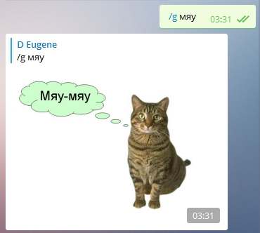
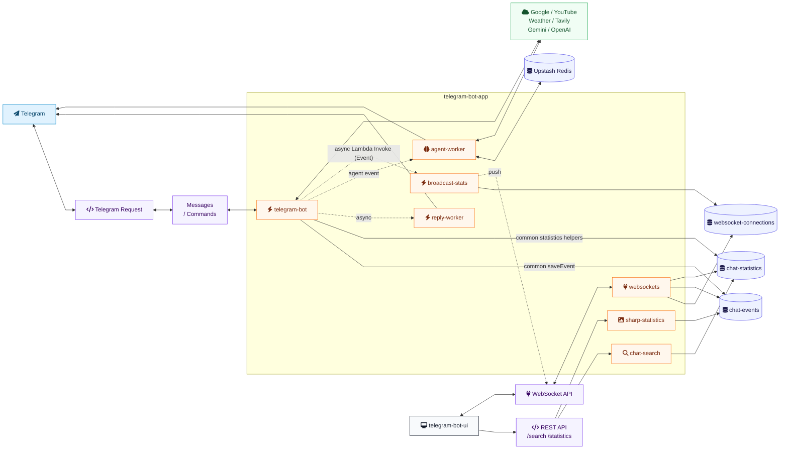
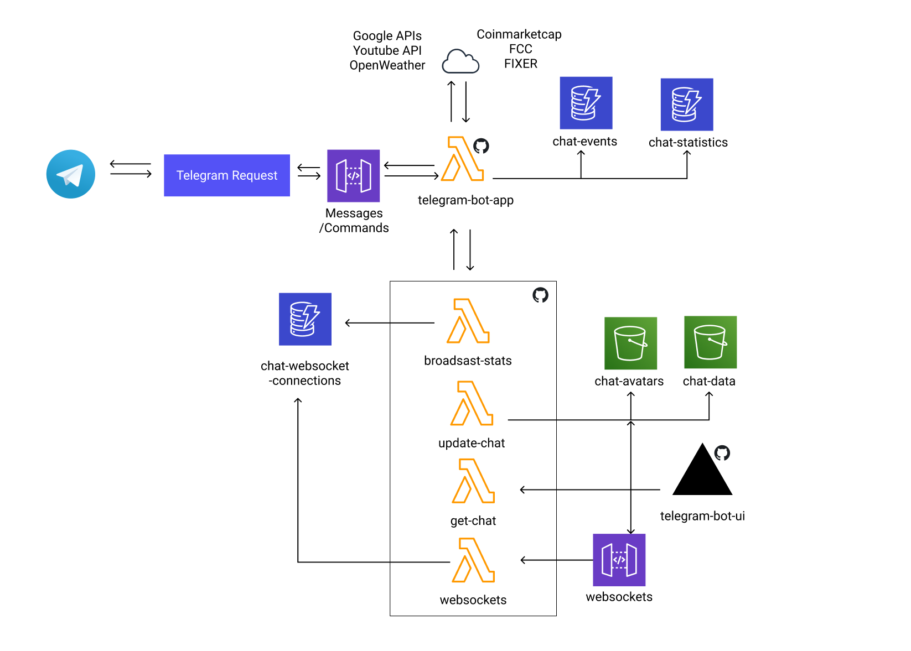

# AWS serverless telegram bot

Serverless Telegram bot based on [grammY](https://github.com/grammyjs/grammY)
and [Serverless Framework](https://github.com/serverless/serverless).

## Architecture

```mermaid
%%{init: {"flowchart": {"curve": "linear", "nodeSpacing": 38, "rankSpacing": 54}} }%%
flowchart LR
  tg["fa:fa-paper-plane Telegram"]:::telegram
  req["fa:fa-code Telegram Request"]:::gateway
  msg["Messages<br/>/ Commands"]:::gateway

  subgraph app["telegram-bot-app"]
    bot["fa:fa-bolt telegram-bot"]:::lambda
    reply["fa:fa-bolt reply-worker"]:::lambda
    agent["fa:fa-brain agent-worker"]:::lambda
    search["fa:fa-search chat-search"]:::lambda
    image["fa:fa-image sharp-statistics"]:::lambda
    broadcast["fa:fa-bolt broadcast-stats"]:::lambda
    ws["fa:fa-plug websockets"]:::lambda
  end

  apis["fa:fa-cloud Google / YouTube<br/>Weather / Tavily<br/>Gemini / OpenAI"]:::external

  events[("fa:fa-database chat-events")]:::data
  stats[("fa:fa-database chat-statistics")]:::data
  conns[("fa:fa-database websocket-connections")]:::data
  redis[("fa:fa-database Upstash Redis")]:::data

  ui["fa:fa-desktop telegram-bot-ui"]:::ui
  http["fa:fa-code REST API<br/>/search /statistics"]:::gateway
  wss["fa:fa-plug WebSocket API"]:::gateway

  tg <--> req <--> msg <--> bot
  bot -->|"common saveEvent"| events
  bot -->|"common statistics helpers"| stats
  bot -. "async" .-> reply
  bot -. "agent event" .-> agent
  bot -. "async Lambda Invoke (Event)" .-> broadcast

  reply --> tg
  agent --> tg
  agent <--> redis
  agent <--> apis
  bot <--> apis

  ui --> http
  http --> search --> stats
  http --> image --> events

  ui <--> wss <--> ws
  ws --> conns
  ws --> events
  ws --> stats
  broadcast --> conns
  broadcast -. "push" .-> wss

  classDef telegram fill:#e0f2fe,stroke:#0284c7,color:#0c4a6e
  classDef gateway fill:#f5f3ff,stroke:#7c3aed,color:#3b0764
  classDef lambda fill:#fff7ed,stroke:#f97316,color:#7c2d12
  classDef data fill:#eef2ff,stroke:#4f46e5,color:#1e1b4b
  classDef ui fill:#f8fafc,stroke:#111827,color:#111827
  classDef external fill:#f0fdf4,stroke:#16a34a,color:#14532d
```

Legacy architecture

## How It Works

`src/telegram-bot` is the Telegram ingress layer. It handles the webhook,
updates chat statistics, stores message events and returns quickly. Long-running
work is invoked asynchronously so the webhook is not blocked by LLM calls.

`src/agent-worker` owns the agentic flow: chat-enabled checks, reply gating,
main response generation and tool execution. This keeps AI decisions out of the
webhook lambda.

`src/websockets` owns only the WebSocket runtime for the stats UI: connection
tracking, initial `stats` responses and live broadcast fanout when new chat
events are written. `saveEvent` lives in `src/common`; any lambda that writes a
chat event through it can trigger the broadcast lambda.

`src/chat-search` owns the REST `/search` endpoint used by
`telegram-bot-ui` to discover chats. It reads `chat-statistics`; it is separate
from WebSockets because it is ordinary request/response HTTP.

`src/sharp-statistics` renders the PNG statistics image from stored chat events.

`src/common` contains shared runtime code: Telegram helpers, DynamoDB access,
Lambda invocation, S3 helpers, Upstash Redis access, logging, formatting and
shared types.

## Related Projects

- [telegram-bot-ui](https://github.com/EugeneDraitsev/telegram-bot-ui)
- Legacy: [telegram-bot-websockets](https://github.com/EugeneDraitsev/telegram-bot-websockets)
