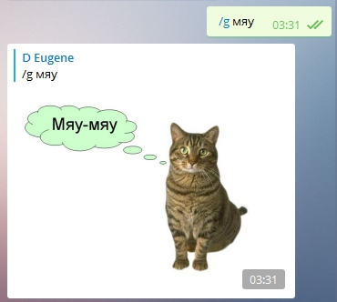

# AWS serverless Telegram bot

[](http://www.serverless.com)
[](https://github.com/EugeneDraitsev/telegram-bot-app/actions/workflows/deploy.yml)
[](https://github.com/EugeneDraitsev/telegram-bot-app/actions/workflows/codeql.yml)

Serverless Telegram bot built with [grammY](https://github.com/grammyjs/grammY)
and [Serverless Framework](https://github.com/serverless/serverless).



## Architecture

Everything at a glance:

<a href=".github/architecture-overview-light.svg">
  <picture>
    <source media="(prefers-color-scheme: dark)" srcset=".github/architecture-overview-dark.svg">
    
  </picture>
</a>

### Message path

How one Telegram update becomes a reply:

<a href=".github/architecture-message-path-light.svg">
  <picture>
    <source media="(prefers-color-scheme: dark)" srcset=".github/architecture-message-path-dark.svg">
    
  </picture>
</a>

### Statistics and live UI

What the activity worker writes and how the stats page stays live:

<a href=".github/architecture-stats-ui-light.svg">
  <picture>
    <source media="(prefers-color-scheme: dark)" srcset=".github/architecture-stats-ui-dark.svg">
    
  </picture>
</a>

Diagram sources are in [`.github/diagram`](.github/diagram). Run
`bun run diagram` after changing them.

## Runtime

The webhook in `src/telegram-bot` returns quickly after dispatching FIFO SQS
jobs. A Telegram chat id is the message group id, so each chat stays ordered
while different chats run in parallel.

- `activity-worker` records statistics, chat events, AI history, and live UI
  updates.
- `telegram-reply-worker` handles registered non-agent commands.
- `agent-worker` handles commands from `AGENT_COMMANDS`, dynamic commands,
  reply gating, model calls, and tools.
- `websockets` serves authenticated live statistics.
- `sharp-renderer` renders PNG cards and charts.
- `video-trimmer` cuts and reframes Telegram videos and video notes with
  ffmpeg.
- `currency-scheduler` posts scheduled currency digests.
- `admin-api` verifies Telegram OIDC logins and exposes owner-only chat
  configuration reads and writes.

DynamoDB chat configuration controls AI access. Ingress checks it before
enqueueing agent work, and the agent worker checks it again before processing.
Redis leases prevent duplicate Telegram replies when SQS redelivers a message;
activity writes are independently replay-safe. Worker queues use one-message
batches, partial batch responses, and separate dead-letter queues.

## Agent media

Current, replied-to, and album media is registered in structured
`MESSAGE_CONTEXT` and `MEDIA` blocks with stable `media_id` values and source
message metadata. Historical media remains text-only until the model selects an
exact Telegram `message_id`; `load_chat_media` then downloads only that
message's images and exposes them on the next model round. Old images are never
preloaded automatically.

Media tools use exact ids for explicit selection, omit `mediaIds` for current
request media, and use `[]` for text-only generation. Inline inputs are limited
to 14 MiB for Google media tools, and one request may produce at most one
generated media result.

Omni only edits or extends short clips, so a longer selected video or video
note is re-downloaded and cut to its first seconds by the `video-trimmer`
lambda once the generation slot is claimed. The clip is also centre-cropped to
the 9:16 or 16:9 frame the generation was asked for, because Omni outputs
nothing else and would otherwise re-frame a square video note on its own.
Padding is avoided on purpose: a generator copies black bars into its output.
The ffmpeg layer is built by `bun run prepare:ffmpeg-layer`, which `build` and
`deploy` run for you.

Delivery uses Telegram's native media methods with document fallback. Google
media calls use the Vercel AI SDK and `GEMINI_API_KEY`
(`GOOGLE_GENERATIVE_AI_API_KEY` also works).

## Local development

Docker must be running. Start Serverless Offline and its ElasticMQ container:

```sh
bun run start
```

During `serverless-offline`, the read-only chat authorization gates are open,
FIFO deduplication ids include a nonce, and Redis worker leases are bypassed.
This lets the same Telegram `message_id` run repeatedly without reading the
production chat-configuration table. The framework alone sets `IS_OFFLINE`;
deployed Lambdas never receive it. Configuration writes are not emulated.

## Owner admin API

The admin dashboard uses Telegram's authorization-code OIDC flow. The UI
exchanges the one-time code server-side, then this service verifies the signed
Telegram ID token and requires its user id to equal `BOT_OWNER_ID`. Successful
logins receive a separate 12-hour admin session; AWS credentials are never sent
to the UI.

Configure these deployment values:

- repository variable `TELEGRAM_OIDC_CLIENT_ID` from BotFather;
- repository secret `ADMIN_SESSION_SECRET` with at least 32 random characters;
- the existing repository variable `BOT_OWNER_ID` with the sole allowed
  Telegram user id.

The Lambda role can only scan the chat configuration/statistics tables and
read or update the configuration table. It has no Redis, queue, model, or bot
token access.

Stop with `Ctrl+C` so Serverless can remove ElasticMQ cleanly.

## Checks

```sh
bun run biome
bun run tsc
bun test
bun run build
```

## Related projects

- [telegram-bot-ui](https://github.com/EugeneDraitsev/telegram-bot-ui)
- Legacy: [telegram-bot-websockets](https://github.com/EugeneDraitsev/telegram-bot-websockets)
