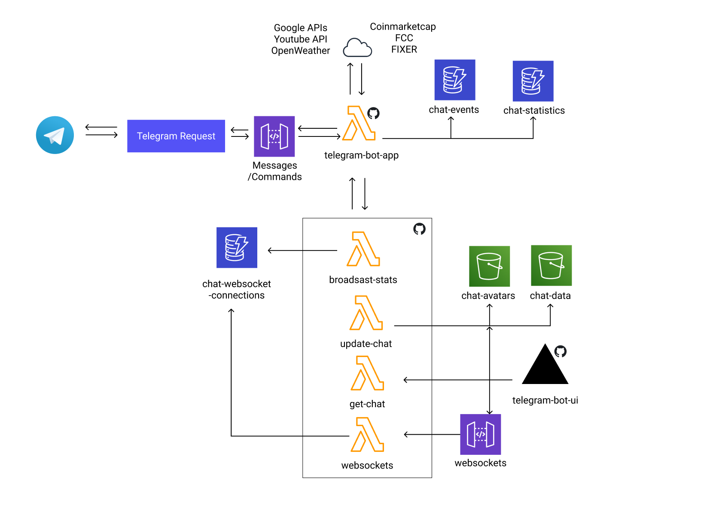

# AWS serverless telegram bot

[](http://www.serverless.com)
[](https://github.com/EugeneDraitsev/telegram-bot-app/actions/workflows/deploy.yml)
[](https://github.com/EugeneDraitsev/telegram-bot-app/actions/workflows/codeql.yml)

Serverless Telegram bot based on [grammY](https://github.com/grammyjs/grammY)
and [Serverless Framework](https://github.com/serverless/serverless).


## Architecture

<a href=".github/architecture-sqs-light.svg">
  <picture>
    <source media="(prefers-color-scheme: dark)" srcset=".github/architecture-sqs-dark.svg">
    
  </picture>
</a>

The diagram source lives in
[`.github/diagram/architecture.mmd`](.github/diagram/architecture.mmd);
re-render both themes with `bun run diagram` after changing it.

<details>
<summary>Legacy architecture</summary>



</details>

## How It Works

`src/telegram-bot` is the Telegram ingress layer. It handles the webhook,
records no statistics directly and returns quickly. It only dispatches durable
FIFO SQS jobs:

- every message payload goes to `telegram-activity-worker` for statistics,
  chat events, live stats broadcast and AI chat history persistence;
- registered agent commands defined by
  [`AGENT_COMMANDS`](src/telegram-bot/agent/index.ts) go directly to
  `telegram-agent-worker` with the reply gate bypassed;
- other registered commands go to `telegram-reply-worker`;
- non-command messages fall through to `telegram-agent-worker`;
- unregistered slash commands are allowed to reach the agent flow for dynamic
  commands;
- commands addressed to another bot are ignored.

Agent dispatch is gated by the permanent `chat-configuration` DynamoDB item in
ingress. The five-second warm-instance cache keeps this to at most one strongly
consistent `GetItem` per active chat/instance/window; disabled chats consume no
agent SQS message or worker invocation. DynamoDB failures fail closed and feed
an alarm from the ingress, reply, agent, and activity log groups. The agent
worker repeats the check before any AI work to cover stale, direct, and retried
queue deliveries.

Effective access requires the global kill switch, owner-controlled `aiAllowed`,
and administrator-controlled `agenticEnabled` to all be true. Only the numeric
`BOT_OWNER_ID` can use `/allowai` and `/disallowai`; Telegram chat creators and
administrators can use `/toggle` after the owner allows the chat. Configuration
changes propagate across warm Lambda instances within about five seconds.

Registered commands are detected from Telegram `bot_command` entities at offset
0. Command names are normalized before worker dispatch so uppercase commands
and caption commands still match the same worker-side grammY handlers.

`src/telegram-bot/telegram-reply-worker` owns registered non-agent commands:
text helpers, search/translate/weather/currency/user/stat commands, and bot
configuration commands.

`src/agent-worker` owns the agentic flow: chat-enabled checks, reply gating,
main response generation and tool execution. This keeps AI decisions out of the
webhook lambda.

`src/telegram-bot/activity-worker` owns the non-reply side effects that used to
run in ingress: statistics updates, chat event writes, AI chat history writes
and WebSocket stats broadcast fanout. The webhook waits only for the SQS
`SendMessage` ACK, not for these tasks to complete.

The chat event and the message counter are written in one DynamoDB
transaction. The event insert is conditional on its own key, which is derived
from the message date and id, so replaying a message cancels the transaction
and the counter cannot drift. The event item is the message's natural
idempotency key, which is why this worker needs no marker keys.

Reply, agent and activity jobs have separate FIFO queues and DLQs. Telegram chat
ids are used as message groups, so jobs stay ordered inside one chat while
different chats can run concurrently.

SQS delivery is at least once, so every worker has to survive being handed the
same message twice. Agent and reply jobs take a six-minute Redis lease first:
they send Telegram messages, and a send can neither be undone nor deduplicated
by Telegram. The lease is longer than the five-minute Lambda timeout, so it
needs no heartbeat. Successful jobs replace it with a three-hour completed
marker using one `SET`; failed jobs release it using one `GETDEL`. Activity jobs
need no marker at all — each of their writes is replay safe on its own, so
redelivery is simply harmless.

CloudWatch alarms watch all three worker DLQs. More than three visible messages
sends an SNS email notification to
`WORKER_FAILURE_ALERT_EMAIL` (defaults to `ddrrai@gmail.com`). The email
subscription must be confirmed once after the first deployment.

`src/websockets` owns only the WebSocket runtime for the stats UI: connection
tracking, initial `stats` responses and live broadcast fanout when new chat
events are written. `recordChatActivity` lives in `src/common`; any lambda that writes a
chat event through it can trigger the broadcast lambda.

Statistics pages are private. The reply worker creates a short-lived,
chat-specific signed URL, and the WebSocket handler verifies that token before
subscribing a browser or returning chat data. There is no public chat search
endpoint.

User counters live only in `chat-user-statistics`, one DynamoDB item per user
and chat. Every statistics read and update uses this per-user schema.

The permanent `chat-configuration` table is provisioned by the application
CloudFormation stack with on-demand billing, deletion protection, retention
policies, and point-in-time recovery. It has one String partition key
(`chatId`), no sort key, and no TTL. DynamoDB is the only runtime source of
truth for both chat authorization flags.

`src/sharp-renderer` renders PNG images for Telegram messages, including
chat activity charts and currency rate cards.

`src/telegram-bot/currency-scheduler` posts a currency digest to selected chats
on weekday mornings and evenings. AI chat-history reads expose exactly the last
24 hours for every owner-allowed chat, including while `/toggle` is off. Every
write uses `ZADD`; cleanup and a 25-hour physical key expiry are refreshed at
most once per hour and warm Lambda instance. The extra physical hour prevents
the visible window from expiring early between refreshes. AI
metrics likewise use one `ZADD` per event and run 30-day cleanup at most hourly
per warm instance (or when a report first needs it).

Slow-changing Redis values (chat/global memory and dynamic tools) use a
60-second per-Lambda-instance TTL cache. Successful writes refresh the local
cache; other warm instances converge when their TTL expires.

Unit tests fail closed before constructing the shared Upstash client when
`NODE_ENV=test`. Bun can automatically load a developer's real `.env`, so this
guard prevents local or CI test runs from consuming production Redis commands.

`src/common` contains shared runtime code: Telegram helpers, DynamoDB access,
SQS job dispatch, Lambda invocation, Upstash Redis access, logging, formatting
and shared types.

## Local SQS development

Docker Desktop (or another Docker daemon) must already be running. Serverless
Offline starts and removes only the ElasticMQ container automatically and
creates the queues from `resources.yml`.

```sh
bun run start
```

Stop it with a normal `Ctrl+C` so Serverless can clean up ElasticMQ. A hard stop
from an IDE can bypass that cleanup and leave the container running on port
`9324`; this is harmless, and the next `bun run start` automatically replaces
the stale container. Stop it from Docker Desktop if you want to free the port
and memory immediately. `bun test` uses synthetic SQS events and never starts
Docker or Serverless.

## Related Projects

- [telegram-bot-ui](https://github.com/EugeneDraitsev/telegram-bot-ui)
- Legacy: [telegram-bot-websockets](https://github.com/EugeneDraitsev/telegram-bot-websockets)
