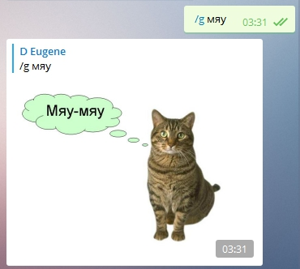

# AWS serverless Telegram bot

[](http://www.serverless.com)
[](https://github.com/EugeneDraitsev/telegram-bot-app/actions/workflows/deploy.yml)
[](https://github.com/EugeneDraitsev/telegram-bot-app/actions/workflows/codeql.yml)

Serverless Telegram bot built with [grammY](https://github.com/grammyjs/grammY)
and [Serverless Framework](https://github.com/serverless/serverless).



## Architecture

Everything at a glance:

<a href=".github/architecture-overview-light.svg">
  <picture>
    <source media="(prefers-color-scheme: dark)" srcset=".github/architecture-overview-dark.svg">
    
  </picture>
</a>

### Message path

How one Telegram update becomes a reply:

<a href=".github/architecture-message-path-light.svg">
  <picture>
    <source media="(prefers-color-scheme: dark)" srcset=".github/architecture-message-path-dark.svg">
    
  </picture>
</a>


### Statistics and live UI

What the activity worker writes and how the stats page stays live:

<a href=".github/architecture-stats-ui-light.svg">
  <picture>
    <source media="(prefers-color-scheme: dark)" srcset=".github/architecture-stats-ui-dark.svg">
    
  </picture>
</a>

Diagram sources are in [`.github/diagram`](.github/diagram). Run
`bun run diagram` after changing them.

## Runtime

The webhook in `src/telegram-bot` returns quickly after dispatching FIFO SQS
jobs. A Telegram chat id is the message group id, so each chat stays ordered
while different chats run in parallel.

- `activity-worker` records statistics, chat events, AI history, and live UI
  updates.
- `telegram-reply-worker` handles registered non-agent commands.
- `agent-worker` handles commands from `AGENT_COMMANDS`, dynamic commands,
  reply gating, model calls, and tools.
- `websockets` serves authenticated live statistics.
- `sharp-renderer` renders PNG cards and charts.
- `video-trimmer` cuts and reframes Telegram videos and video notes with
  ffmpeg.
- `currency-scheduler` posts scheduled currency digests.
- `admin-api` verifies Telegram OIDC logins and exposes owner-only chat
  configuration reads and writes.

DynamoDB chat configuration controls AI access. Ingress checks it before
enqueueing agent work, and the agent worker checks it again before processing.
Redis leases prevent duplicate Telegram replies when SQS redelivers a message;
activity writes are independently replay-safe. Worker queues use one-message
batches, partial batch responses, and separate dead-letter queues.

If both an agent response and its failure notice cannot be delivered, the job
is retried. Once any response part has been acknowledged by Telegram, a later
delivery failure does not replay the whole job, avoiding duplicate response
parts. Delivery errors remain in the logs.

Permanent chat events and user statistics are retained on stack deletion or
resource replacement, with DynamoDB deletion protection and point-in-time
recovery enabled.

## Agent media

Current, replied-to, and album media is registered in structured
`MESSAGE_CONTEXT` and `MEDIA` blocks with stable `media_id` values and source
message metadata. Historical media remains text-only until the model selects an
exact Telegram `message_id`; `load_chat_media` then downloads only that
message's images and exposes them on the next model round. Old images are never
preloaded automatically.

The agent waits for album messages and downloads request media only after the
reply gate accepts the message (or an accepted agent command bypasses it).
Downloads run at most three at a time, each with a 10-second deadline covering
metadata and body transfer. The 19 MiB per-file limit is checked before and
during streaming; unavailable or oversized files are skipped.

Media tools use exact ids for explicit selection, omit `mediaIds` for current
request media, and use `[]` for text-only generation. Inline inputs are limited
to 14 MiB for Google media tools, and one request may produce at most one
generated media result.

Omni only edits or extends short clips, so a longer selected video or video
note is re-downloaded and cut to its first seconds by the `video-trimmer`
lambda once the generation slot is claimed. The clip is also centre-cropped to
the 9:16 or 16:9 frame the generation was asked for, because Omni outputs
nothing else and would otherwise re-frame a square video note on its own.
Padding is avoided on purpose: a generator copies black bars into its output.
The ffmpeg layer is built by `bun run prepare:ffmpeg-layer`, which `build` and
`deploy` run for you.

Delivery uses Telegram's native media methods with document fallback. Google
media calls use `GEMINI_API_KEY`
(`GOOGLE_GENERATIVE_AI_API_KEY` also works).

Voice messages use Gemini 3.8 Flash TTS through the Google Interactions API,
with `Kore` as the default voice. The `generate_voice` tool accepts a built-in
voice or reusable `voice_...` ID, a delivery `style`, and a `voice_description`
for a fictional character's timbre. Described voices are created for one
request and deleted after synthesis, including on failure; cleanup failures
are logged. Existing voice IDs are never deleted. Voice design and speech
generation each get a 90-second deadline, with a 240-second total tool budget
including encoding and cleanup. Audio is converted from WAV to Ogg/Opus by
the shared ffmpeg layer attached to the agent worker. The 32 MiB WAV and 8 MiB
encoded-audio bounds cover the model's full audio output budget, including
long passages spoken slowly.

The agent worker has a 13-minute deadline to accommodate model fallbacks,
data-gathering rounds and voice generation before delivery. Its Redis
processing lease lasts 14 minutes; the agent queue's visibility timeout is
78 minutes (six times the worker deadline). Serial tool batches execute at
most two calls per round, returning explicit tool results for excess calls
so the model can combine queries or request them in a later round.

### Command cyber safety

Registered agent commands (including `/q` and `/o`) bypass engagement gating,
but first pass a text cyber-abuse check using the
[OpenAI Decisions API](https://developers.openai.com/api/reference/resources/decisions/methods/create)
with Luna. A custom predicate evaluates the current request and its replied-to
text; a cyber-abuse probability of 0.5 or above blocks further processing.
This is the application's classification rubric, not an official OpenAI ban-risk
score. Classification refusals, invalid responses and API errors fail closed.

Rejected requests receive a short refusal generated by the cheap safety role,
without passing the original request, history or tools to that generation call.
A fixed message covers refusal-generation failure; classification outages get a
retry-later message. Allowed commands keep their normal chat model and reasoning.
The check covers text and replied-to text, not the contents of media or URLs.
It reduces abuse reaching the main model and does not guarantee account access.

Agent model calls and Decisions share a hashed, stable Telegram sender identifier
across chats. Anonymous/channel messages use their sender-chat identity, with a
chat identity as the last fallback. Chat IDs remain separate in logs and metrics.

`bun run eval:command-safety` runs a small labelled live evaluation with
`OPENAI_API_KEY` (and an optional `GEMINI_API_KEY` for refusal fallback).
It makes classification calls and one generic refusal call; it never invokes
Astra or executes the labelled requests. An optional output path saves the report.

### Model selection

Language models, reasoning effort and fallbacks are configured in
`src/agent-worker/agent/models.ts`. Media models belong to their services;
the shared Gemini image model is defined in `src/common/utils/gemini-image.utils.ts`.

Image routing and quality are configured in
`src/agent-worker/services/image-generation.ts`:

| Request | Model | Quality | Fallback |
| --- | --- | --- | --- |
| Ordinary image request | Gemini 3.1 Flash Lite Image | Provider default | GPT Image 2.5 Flare (low) |
| `/e`, `/ee`, `/gp`, `/de` | GPT Image 2.5 Sunburst | medium | None |
| `/ge` | Gemini 3.1 Flash Lite Image | Provider default | None |

Each image model is called once. Ordinary requests reserve 55 seconds for
each provider; explicit commands allow 110 seconds for the selected model.
The tool has a 120-second total budget. `tool.model_call` records each actual
model, with `fallbackFrom` and `toolCallId` to connect related calls.

## Local development

Docker must be running. Start Serverless Offline and its ElasticMQ container:

```sh
bun run start
```

Outside AWS, video trimming and voice encoding use `ffmpeg` on `PATH`;
point `FFMPEG_PATH` at a binary to override that.

During `serverless-offline`, the read-only chat authorization gates are open,
FIFO deduplication ids include a nonce, and Redis worker leases are bypassed.
This lets the same Telegram `message_id` run repeatedly without reading the
production chat-configuration table. The framework alone sets `IS_OFFLINE`;
deployed Lambdas never receive it. Configuration writes are not emulated.

## Owner admin API

The admin dashboard uses Telegram's authorization-code OIDC flow. The UI
exchanges the one-time code server-side, then this service verifies the signed
Telegram ID token and requires its user id to equal `BOT_OWNER_ID`. Successful
logins receive a separate 12-hour admin session; AWS credentials are never sent
to the UI.

Configure these deployment values:

- repository variable `TELEGRAM_OIDC_CLIENT_ID` from BotFather;
- repository secret `ADMIN_SESSION_SECRET` with at least 32 random characters;
- the existing repository variable `BOT_OWNER_ID` with the sole allowed
  Telegram user id.

The Lambda role can only scan the chat configuration/statistics tables and
read or update the configuration table. It has no Redis, queue, model, or bot
token access.

Stop with `Ctrl+C` so Serverless can remove ElasticMQ cleanly.

## Checks

```sh
bun run audit
bun run biome
bun run tsc
bun test
bun run build
```

`braces@3.0.3`, used by the build tooling, has a local Bun patch for
[GHSA-vfj7-8cjw-p6xm](https://github.com/advisories/GHSA-vfj7-8cjw-p6xm).
The parser caps nesting at 256 levels and treats deeper input as literal text,
following [the upstream fix proposal](https://github.com/micromatch/braces/pull/79).
The patch is reapplied on install through `patchedDependencies`.

`bun run audit` first runs regression tests against the installed package,
then excludes only this locally fixed advisory because the registry still
identifies the patched dependency as version 3.0.3. Other advisories continue
to fail the audit. Remove the patch and this exclusion when a fixed upstream
release becomes available.

## Related projects

- [telegram-bot-ui](https://github.com/EugeneDraitsev/telegram-bot-ui)
- Legacy: [telegram-bot-websockets](https://github.com/EugeneDraitsev/telegram-bot-websockets)
